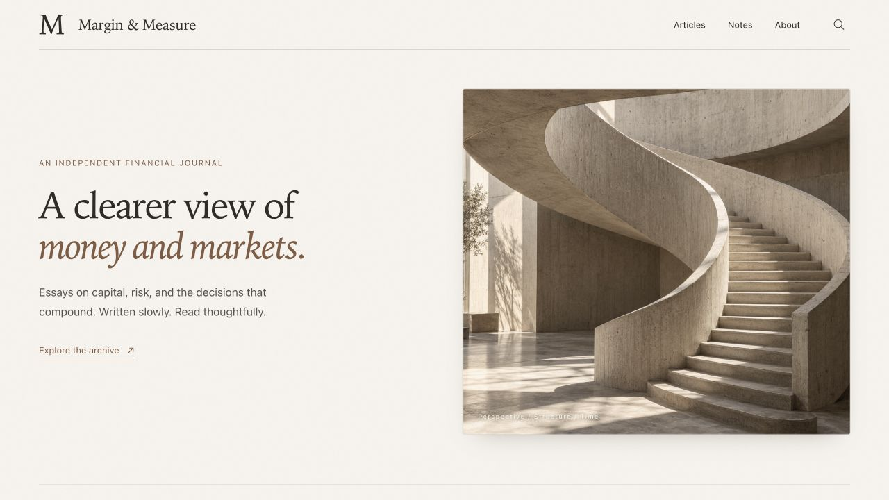
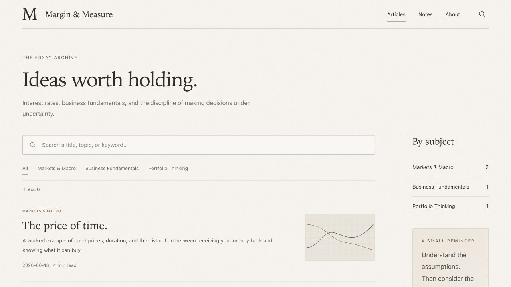
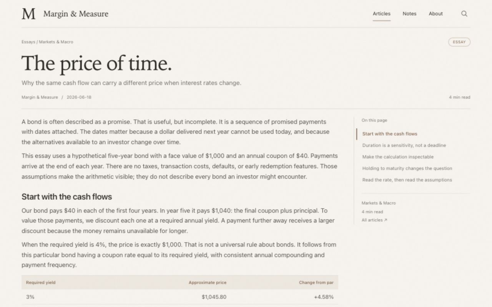
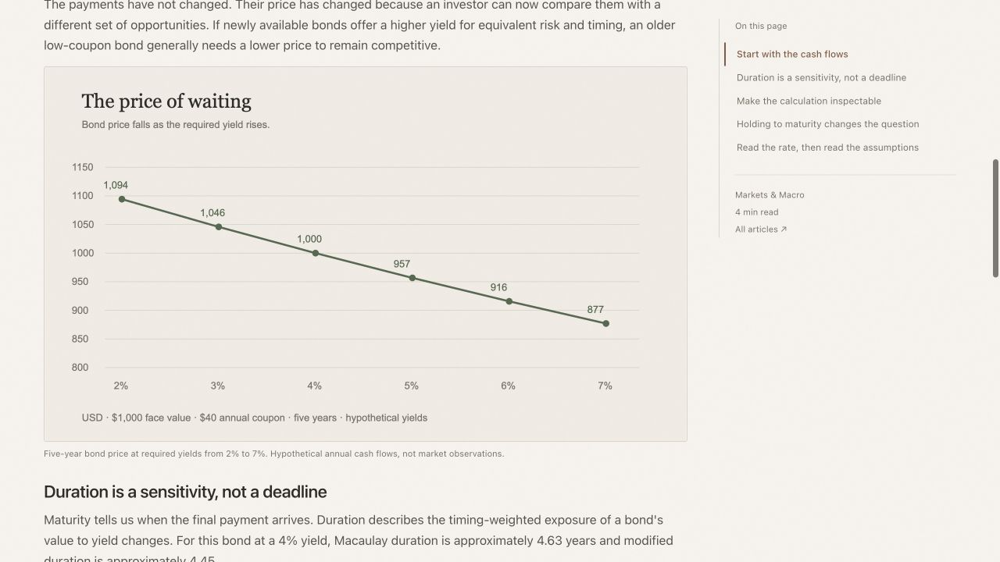
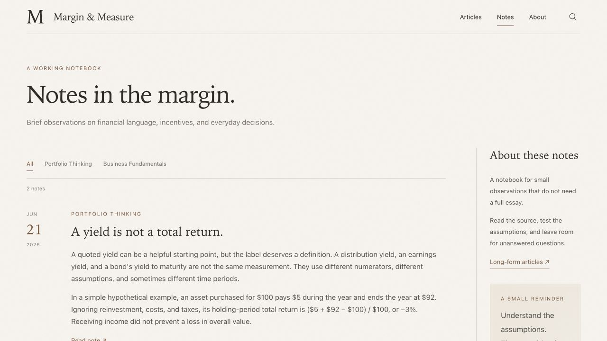
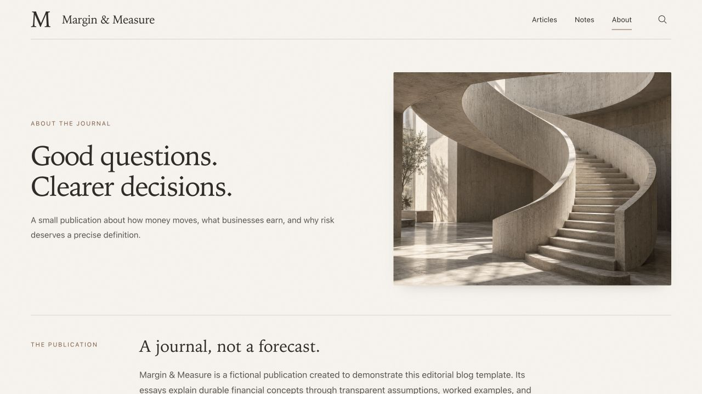
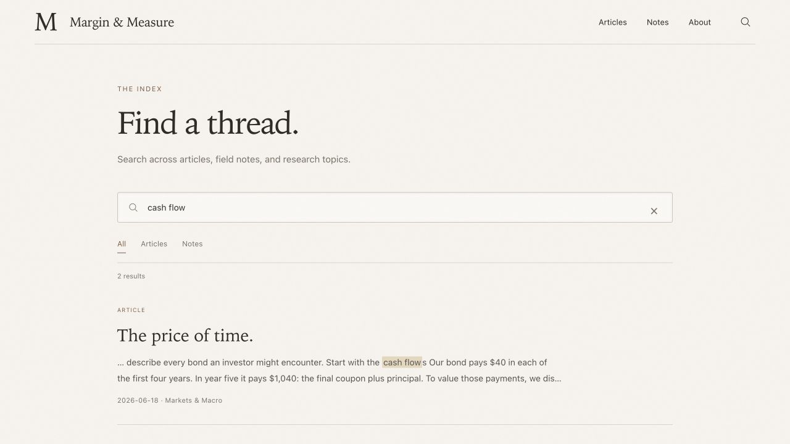
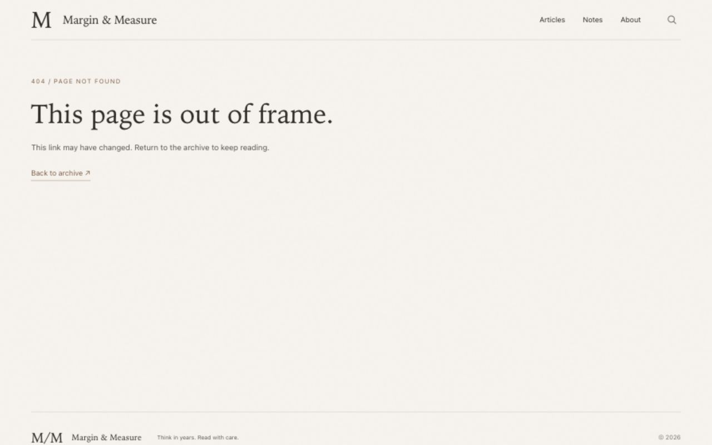
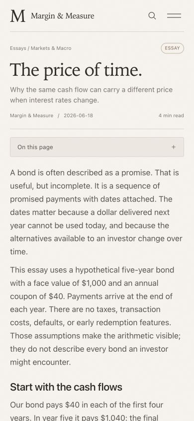

# Editorial Blog Template

**A warm, restrained editorial theme for people who have something to say.**

Built with Next.js 16, React 19, TypeScript, and Markdown. The included fictional publication, **Margin & Measure**, demonstrates the theme with four complete English finance essays and two short notes.

**Guides:** [写作与定制指南 / Writing & customization](docs/WRITING.zh-CN.md) · [Design notes](docs/DESIGN.md) · [中文设计说明](docs/DESIGN.zh-CN.md)

## Use this template

Click **Use this template → Create a new repository**, then:

```sh
nvm use
npm ci
npm run dev
```

Open `http://localhost:3000`. Use Node.js 22. No database, CMS account, API key, or external font service is required.

## What is included

- Home, article archive, article detail, Notes, About, Search, and 404 pages.
- Full-text client-side search with shareable query/filter URLs.
- Metadata-driven categories, tags, related reading, and curated featured essays.
- A separate recent-writing list sorted by article date, including featured entries.
- Markdown tables, blockquotes, lists, syntax highlighting, and copyable code.
- A sticky desktop table of contents and collapsible mobile contents.
- Responsive images with dimensions reserved before loading.
- Static export, CI checks, and an optional GitHub Pages workflow that starts disabled.
- Original sample writing and locally stored finance diagrams; no personal research records or fabricated author credentials.

## Design

The visual language borrows from a printed journal: warm paper, quiet rules, generous headlines, compact reading rhythm, and a small number of deliberate accents. It is meant for sustained reading, not a financial trading terminal.

| Role | Choice |
| --- | --- |
| Paper | `#f6f3ed` |
| Ink | `#2c2b27` |
| Walnut accent | `#825b42` |
| Sage accent | `#53684f` |
| Borders | `#dbd5ca` |
| Display type | Iowan Old Style / Baskerville / Georgia, using local system fonts |
| Body | System sans serif, 16px / 1.65 in articles |
| Code | System monospace, 13px / 1.5; 12px on small screens |

A wide desktop layout separates the reading column from its contents navigation. Article paragraphs have a 10px bottom margin; figures and section breaks provide stronger pauses. Long code blocks scroll internally rather than overwhelming the page. Below the mobile breakpoint, the layout becomes a single column and navigation collapses.

Typography varies slightly by operating system because the template does not download proprietary typefaces. The screenshots below are actual browser captures of this repository, rather than design mockups. See [the design notes](docs/DESIGN.md) for layout and component decisions.

## Screenshots

Every page is shown below, followed by the mobile reading layout. These are captures of the working static site.

### Home · 首页

Publication introduction, featured essays, and recent writing.



### Articles · 文章归档

Topic filters, full-text filtering, and article summaries.



### Article · 文章详情

Title, subtitle, byline, body copy, and a separate table of contents.



The reading layout also supports figures, tables, and code blocks.



### Notes · 短札记

A date-led layout for shorter entries.



### About · 关于

Publication profile, areas of focus, and editorial principles.



### Search · 搜索

Full-text results with query highlighting and scope filters.



### 404 · 未找到页面

A dedicated recovery page with a route back to the archive.



### Mobile · 移动端正文

Single-column reading, a collapsible table of contents, and a compact navigation menu.



## Creation notes

This template adapts an editorial design developed through iterative layout work: establishing the paper-and-ink palette, balancing serif headlines with plain body text, reducing oversized gaps, and testing the result with complete articles rather than filler sentences.

The English finance essays were written specifically for the template with AI assistance and reviewed for internal consistency. They are educational examples, not licensed copies of financial journalism, investment advice, or live market reporting. The publication and its fictional business example are clearly identified. Bond prices, cash-flow bridges, and diversification figures use explicit hypothetical assumptions; source links provide background rather than imply endorsement.

The architectural hero image was generated with AI during the original theme design. All finance graphics are editable SVGs built for this template. The three archive illustrations are decorative; the labeled article charts represent the calculations explained in their articles. Real browser screenshots document the implementation. No analytics or tracking service is included.

## Make it yours

Read the **[写作与定制指南](docs/WRITING.zh-CN.md)** for a complete article walkthrough, image paths, field-to-page mappings, layout files, sorting rules, and troubleshooting. Copy the [Markdown starter](docs/examples/article.md) and merge the [metadata example](docs/examples/article-meta.json) to begin.

| File | What to change |
| --- | --- |
| `content/site-config.json` | Publication name, navigation, home copy, About, contact links |
| `content/articles/*.md` | Article and note bodies |
| `content/article-meta.json` | Titles, dates, categories, excerpts, tags, and featured order |
| `public/images/editorial/` | Hero image, card artwork, and article charts |
| `public/icon.svg` | Favicon |
| `app/globals.css` | Color tokens, typography, spacing, and responsive rules |
| `lib/content.ts` | Content loading and related-reading rules |

Create `content/articles/my-essay.md` with one opening H1 and H2 sections. Add a matching `my-essay` entry to `content/article-meta.json`:

```json
{
  "title": "A question worth asking.",
  "subtitle": "The idea in one sentence.",
  "excerpt": "A short archive description.",
  "date": "2026-06-25",
  "category": "Your topic",
  "tags": ["one", "two"],
  "type": "Essay",
  "featuredOrder": 1,
  "artwork": "/images/editorial/rates.svg"
}
```

Categories and tags are free-form. Use `"type": "Journal"` for Notes. Lower `featuredOrder` values come first; omit it for uncurated entries. Dates are explicit editorial metadata, not filesystem timestamps. The metadata file is the source of truth; YAML front matter is not supported.

For an image, use `` and store the file under `public/images/`. The prebuild script reads image dimensions automatically. When adding images during development, run `node scripts/article-image-metadata.mjs` to refresh the dimension map. Original-image comparison links are optional via `content/figure-meta.json`.

Contact fields are intentionally empty. Add your own email and GitHub URL to display the About contact panel. Replace the fictional publication description with truthful author information before using it as a personal site.

## Build and validate

```sh
npm test
npm run typecheck
npm run build
npm run check:export
```

Static files are written to `out/`; `/articles/my-essay/` corresponds to `out/articles/my-essay/index.html`. The checks cover Markdown safety, duplicate heading anchors, all sample articles, related links, base-path handling, and exported image availability.

## Deployment

The repository is public and reusable, but **publishing is off by default**. Pushes and pull requests run CI. The upload/deploy steps only run when the repository variable `PAGES_ENABLED` is exactly `true`.

For GitHub Pages:

1. In **Settings → Pages**, select **GitHub Actions** as the source.
2. For `https://username.github.io/repository/`, set the Actions variable `NEXT_PUBLIC_BASE_PATH` to `/repository`. For a root site or custom domain, leave it empty.
3. If using a custom domain, configure it in Pages settings and DNS, then add your own `public/CNAME`. No domain is bundled with the template.
4. Set the Actions variable `PAGES_ENABLED=true`, then run the workflow or push to `main`.

Next.js links and ordinary image URLs both support the configured prefix. You can check a prefixed export locally:

```sh
NEXT_PUBLIC_BASE_PATH=/my-blog npm run build
NEXT_PUBLIC_BASE_PATH=/my-blog npm run check:export
```

For another static host, deploy `out/` and configure directory-index routing plus `404.html`. No personal access token is needed for the supplied Pages workflow.

## License and attribution

The template code, original sample writing, and bundled custom graphics are provided under the [MIT License](LICENSE). Dependencies retain their own licenses. The AI-generated hero image is included under the same permission to the extent applicable rights can be granted. System fonts are referenced, not distributed. External reference sites are not bundled and retain their owners' rights.

[中文设计与创作说明](docs/DESIGN.zh-CN.md)
